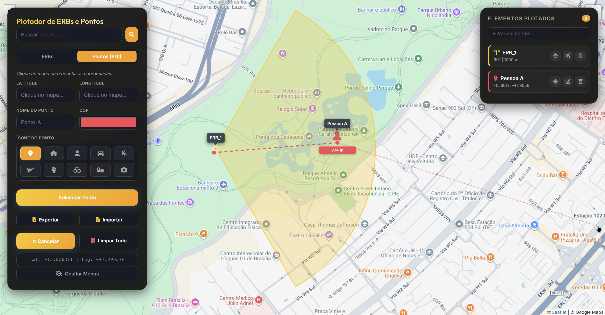

# Plotador de ERBs e Pontos (POI)

Uma ferramenta web moderna e intuitiva para visualização e planejamento de Estações Rádio Base (ERB) e Pontos de Interesse (POI) em mapas interativos.

## 🚀 Funcionalidades

- **Plotagem de ERBs (Setores):** Adicione setores de rádio frequência definindo latitude, longitude, azimute, raio de cobertura e abertura (beamwidth).
- **Pontos de Interesse (POI):** Marque locais específicos no mapa com ícones descritivos (casa, pessoa, veículo, arma, etc.).
- **Ferramenta de Medição:** Meça distâncias precisas entre pontos no mapa com suporte a múltiplos segmentos e interação otimizada.
- **Busca de Endereços:** Localize rapidamente qualquer endereço utilizando integração com OpenStreetMap (Nominatim).
- **Importação/Exportação Excel:** Salve seu trabalho ou carregue listas de dados. Agora com suporte a colunas de **Data e Hora separadas** para maior organização.
- **Modelo de Importação:** Ao exportar com o mapa vazio, a ferramenta gera automaticamente uma planilha modelo com dados de exemplo.
- **Múltiplas Camadas de Mapa:** Suporte para Google Roadmap, Satélite, Híbrido e CartoDB Dark Matter.
- **Interface Moderna:** Design responsivo com suporte a tema escuro, efeitos de vidro (glassmorphism) e **navegação por teclado** (setas) no slider temporal.
- **Gerenciamento de Elementos:** Lista lateral para focar, editar ou remover elementos plotados individualmente.

## 🛠️ Tecnologias Utilizadas

- **HTML5 & CSS3:** Estrutura e estilização moderna com variáveis CSS.
- **JavaScript (Vanilla):** Lógica da aplicação sem dependências pesadas.
- **[Leaflet.js](https://leafletjs.com/):** Biblioteca principal para mapas interativos.
- **[SheetJS](https://sheetjs.com/):** Processamento de arquivos Excel no navegador.
- **[Font Awesome](https://fontawesome.com/):** Conjunto de ícones para a interface e marcadores.
- **[Google Fonts](https://fonts.google.com/):** Tipografias Outfit e Inter para leitura clara.

## 📂 Como Usar

1. **Abrir o Projeto:** Clone o repositório e abra o arquivo `index.html` em qualquer navegador moderno.
2. **Adicionar ERB:** Selecione a aba "ERBs", preencha os dados ou clique no mapa para capturar as coordenadas e clique em "Plotar ERB".
3. **Adicionar Ponto:** Selecione a aba "Pontos (POI)", escolha um ícone e cor, e clique no mapa ou preencha as coordenadas.
4. **Slider Temporal:** Use o slider inferior para filtrar elementos por data/hora. Você pode usar as **setas ← → do teclado** para navegar entre os horários.
5. **Medir Distância:** Clique no botão de régua e vá clicando no mapa para definir o trajeto. Pressione `ESC` para cancelar ou terminar.
6. **Exportar Dados:** Clique no botão "Exportar" para baixar um arquivo Excel com todos os elementos presentes no mapa.
7. **Importar Dados:** Clique em "Importar" e selecione um arquivo Excel. A ferramenta aceita tanto colunas unificadas de data/hora quanto separadas.

## 🔐 Privacidade e Responsabilidade

- **Dados Locais:** Este site não armazena nenhuma informação em servidores. Todos os dados processados permanecem localmente no seu navegador.
- **Análise Técnica:** A interpretação dos dados de cobertura de ERB e a precisão da análise cabem inteiramente ao usuário técnico.
- **Instruções:** Um guia rápido é exibido automaticamente ao carregar o site, acessível a qualquer momento pelo botão `(?)`.

## 📄 Estrutura de Arquivos

- `index.html`: Estrutura principal da página e importação de scripts.
- `script.js`: Lógica de manipulação do mapa, formulários e integração Excel.
- `style.css`: Estilização completa, layouts responsivos e design system.
- `screenshots/`: Pasta destinada a imagens de demonstração.

## 📝 Licença

Este projeto é de uso livre para fins educacionais e profissionais.
